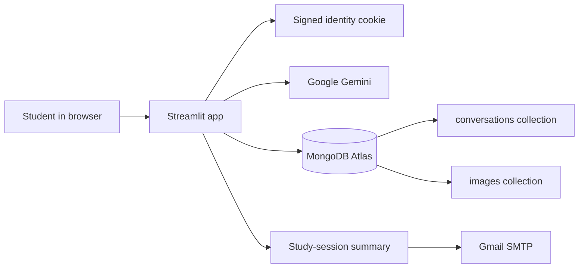

# Snap & Study AI

> **Turn study material into clear, conversational explanations.**

[](https://www.python.org/)
[](https://streamlit.io/)
[](https://ai.google.dev/)
[](https://www.mongodb.com/atlas)
[](#license)

## Overview

Snap & Study AI is a student-focused Streamlit application for learning from text questions and uploaded study images. It uses Google Gemini to explain academic material, remember context across follow-up questions, and generate an email-ready summary of a study session.

Student conversations are persisted in MongoDB Atlas and scoped to the student's normalized email address. A signed browser cookie remembers the student's name and email between visits, so returning to the app can skip onboarding and reload that student's conversation list.

## Key features

- **Multimodal study help:** Ask a question about an uploaded JPG, PNG, or WEBP image, or send an image by itself. Uploads are limited to 10 MB.
- **Text chat:** Ask academic questions without uploading an image.
- **Follow-up conversations:** Gemini receives the active chat's context, including the latest previously uploaded image for text-only follow-ups.
- **Persistent conversation history:** Save conversation messages in MongoDB Atlas and list up to the 100 most recently updated conversations for the signed-in email.
- **Conversation titles:** Create a concise title locally from the first question; image-only conversations receive a temporary title that can be updated when a text question is asked.
- **Old conversation restoration:** Select a history item to reload its messages and Gemini context. Stored images are fetched separately and restored with the conversation.
- **Persistent uploaded image context:** Image binaries are stored in the `images` collection, separate from conversation documents, and can be restored when a conversation is reopened.
- **Browser identity restoration:** A signed, expiring `snap_study_identity` cookie stores only the student's name, email, and expiry. It remembers identity on that browser; it is not an authentication system.
- **New conversation:** Start a fresh chat without deleting saved conversations or changing the current student.
- **Delete conversation:** Delete a selected conversation and its associated images after confirmation.
- **Gmail study-session summary:** Generate a concise summary from the active conversation and send it through Gmail SMTP.
- **Academic-only scope:** The system prompt directs Gemini to help with learning and politely redirect unrelated requests.
- **Streamlit secrets:** API and service credentials are read from Streamlit secrets or environment variables rather than hard-coded into the app.

## Project highlights

| Capability | Implementation |
|---|---|
| Learning assistant | Google Gemini via the `google-genai` SDK |
| Image input | JPG, PNG, WEBP; maximum upload size is 10 MB |
| Long-term conversation storage | MongoDB Atlas using PyMongo |
| Uploaded image storage | Separate MongoDB `images` collection |
| Returning student experience | Signed 30-day browser identity cookie |
| Study summary delivery | Gmail SMTP over SSL |
| User interface | Streamlit |

## Architecture



### User flow

**First visit**

```text
Open app
  → Enter name and email
  → Validate details and initialize Gemini chat
  → Save signed browser identity cookie
  → Ask a text question and/or upload an image
  → Receive Gemini response
  → Save messages to MongoDB conversations
  → Save uploaded image bytes separately in MongoDB images
```

**Returning visit**

```text
Open or refresh app
  → Read and validate the signed identity cookie
  → Restore name and normalized email
  → Initialize a fresh active chat
  → Query MongoDB for that email's conversation list
  → Select a history item to restore its messages and image context
  → Continue asking follow-up questions
```

The app restores the student's identity and conversation list on return. It does **not** automatically reopen the last conversation; the student chooses a saved conversation from the sidebar.

## Tech stack

| Technology | Role |
|---|---|
| Python 3.10+ | Application language |
| Streamlit | UI and application runtime |
| Google Gemini (`google-genai`) | Academic text and image explanations, follow-ups, and summaries |
| MongoDB Atlas | Persistent conversation and image storage |
| PyMongo | MongoDB client and database operations |
| `extra-streamlit-components` | Browser cookie manager |
| Gmail SMTP (`smtplib`) | Summary email delivery |
| Pillow | Uploaded image decoding and validation |

## Project structure

```text
snap-and-study/
├── app.py
├── database.py
├── prompts.py
├── requirements.txt
├── README.md
├── .gitignore
└── .streamlit/
    ├── secrets.toml              # Local/private; ignored by Git
    └── secrets.toml.example      # Safe template with placeholders
```

> The persistence module in this repository is named **`database.py`** with a lowercase `d`, and the application imports it using `import database as store`.

### File responsibilities

| File | Responsibility |
|---|---|
| `app.py` | Streamlit screens and session state; Gemini chat and summaries; image validation; MongoDB integration; Gmail SMTP; signed cookie identity restore and change-student handling. |
| `database.py` | MongoDB client creation, indexes, title generation, and conversation/image save, list, load, and delete operations. It contains no Streamlit UI code. |
| `prompts.py` | Gemini system, welcome, default-image, and study-summary prompt text, including the academic-only scope instructions. |
| `requirements.txt` | Python package requirements for running the app. |
| `.gitignore` | Excludes `.streamlit/secrets.toml`, `.env`, virtual environments, Python caches, and OS metadata from Git. |
| `.streamlit/secrets.toml.example` | Placeholder-only example for local configuration and Streamlit Cloud secrets. |

## MongoDB data model

MongoDB is organized into two collections. Conversation ownership and all reads/deletes are scoped to the student's normalized email address.

### `conversations`

One document per conversation. Text content and image references are stored here; image binaries are not.

```javascript
{
  "conversation_id": "a1b2c3d4e5f6478899aabbccddeeff00",
  "user_email": "student@example.com",
  "user_name": "Student",
  "title": "Python Lists",
  "created_at": ISODate("2026-10-08T10:00:00Z"),
  "updated_at": ISODate("2026-10-08T10:05:00Z"),
  "messages": [
    {
      "role": "user",
      "kind": "text",
      "content": "What is a Python list?",
      "timestamp": ISODate("2026-10-08T10:00:00Z")
    },
    {
      "role": "assistant",
      "kind": "text",
      "content": "A Python list is an ordered, changeable collection...",
      "timestamp": ISODate("2026-10-08T10:00:03Z")
    },
    {
      "role": "user",
      "kind": "image",
      "content": "",
      "image_id": "image-document-id",
      "mime_type": "image/png",
      "timestamp": ISODate("2026-10-08T10:04:00Z")
    }
  ]
}
```

### `images`

One document per uploaded image. The message in `conversations.messages` references it by `image_id`.

```javascript
{
  "image_id": "image-document-id",
  "conversation_id": "a1b2c3d4e5f6478899aabbccddeeff00",
  "user_email": "student@example.com",
  "mime_type": "image/png",
  "data": BinData(0, "<binary image bytes>"),
  "created_at": ISODate("2026-10-08T10:04:00Z")
}
```

Separating image bytes from conversation documents helps keep conversation records smaller and avoids placing large images in the embedded message array. MongoDB still enforces its document-size limit on each individual image document.

## Local setup

### 1. Clone the repository

Replace the placeholder with the actual repository URL:

```bash
git clone <YOUR_GITHUB_REPOSITORY_URL>
cd snap-and-study
```

If the application files are in a nested `snap-and-study/` folder in your clone, change into that folder before running the remaining commands.

### 2. Create and activate a virtual environment

```bash
python -m venv venv
```

**Windows PowerShell**

```powershell
.\venv\Scripts\Activate.ps1
```

**macOS / Linux**

```bash
source venv/bin/activate
```

### 3. Install dependencies

```bash
python -m pip install -r requirements.txt
```

### 4. Configure local secrets

Copy `.streamlit/secrets.toml.example` to `.streamlit/secrets.toml` and replace its placeholders with your own credentials:

```toml
GEMINI_API_KEY = "your_gemini_api_key"
GEMINI_MODEL = "your_supported_gemini_model"

GMAIL_ADDRESS = "your_gmail_address@gmail.com"
GMAIL_APP_PASSWORD = "your_gmail_app_password"

MONGODB_URI = "your_mongodb_atlas_connection_string"
MONGODB_DATABASE = "snap_and_study"

# Optional: use a dedicated server-side key to sign the identity cookie.
# IDENTITY_COOKIE_SECRET = "a-long-random-secret"
```

### 5. Run the app

```bash
streamlit run app.py
```

## Required configuration

| Secret | Purpose |
|---|---|
| `GEMINI_API_KEY` | Authenticates requests to Google Gemini. |
| `GEMINI_MODEL` | Gemini model name. The app uses `gemini-2.5-flash` when this is omitted. Choose a model available to your API key. |
| `GMAIL_ADDRESS` | Gmail account used as the SMTP sender. |
| `GMAIL_APP_PASSWORD` | Gmail App Password used for SMTP authentication. |
| `MONGODB_URI` | MongoDB Atlas connection string. |
| `MONGODB_DATABASE` | Database name; defaults to `snap_and_study`. |

`IDENTITY_COOKIE_SECRET` is optional. When present, it is used to sign the browser identity cookie. Otherwise the app derives a signing key from an existing server-side Gemini API key or MongoDB URI. Keep all of these values server-side.

> ⚠️ **Never commit the real `.streamlit/secrets.toml` file.** It contains credentials. The project `.gitignore` excludes it; commit only the placeholder template. Do not paste secrets into issues, public logs, or screenshots.

## Gmail App Password setup

The application sends mail over Gmail SMTP using SSL on port 465. A regular Gmail password is not suitable for SMTP app authentication.

1. Sign in to the Google account that will send study summaries.
2. Enable **2-Step Verification** for that account.
3. Open the Google Account **App passwords** setting and create an App Password for this application.
4. Put the generated password in `GMAIL_APP_PASSWORD` and the sender account in `GMAIL_ADDRESS`.
5. Do not share the App Password or commit it to the repository.

Google may change the location or availability of App Password settings; follow Google's current account-security guidance if the setting is unavailable.

## MongoDB Atlas setup

1. Create an Atlas project and cluster.
2. Create a database user with a strong password and only the access required by this application.
3. Configure Atlas network access to allow the app host to connect. For Streamlit Community Cloud, use the access option appropriate to your deployment; the service may not provide a fixed outbound IP.
4. Copy the Atlas connection string and set `MONGODB_URI`. URL-encode special characters in the database username or password as required by MongoDB.
5. Set `MONGODB_DATABASE`, or use the default `snap_and_study`.

When a connection is established, the app ensures its indexes and uses the `conversations` and `images` collections. If MongoDB is not configured, the app displays that conversation history is unavailable. If the configured database cannot be reached, the app displays a temporary-unavailability warning; history-dependent actions cannot succeed until the connection is restored.

## Prompt engineering

Prompt text is maintained in `prompts.py` rather than mixed into UI code. The system prompt limits the assistant to educational help, requests clear and beginner-friendly explanations, gives guidance for image, programming, math, and study-note questions, and asks Gemini to acknowledge uncertainty or unreadable image content. It also instructs the assistant to redirect off-topic requests.

The summary prompt asks Gemini to summarize the actual conversation, including meaningful follow-ups and image topics, without inventing lessons. Gemini is a generative model: prompt instructions guide its behavior but do not guarantee correctness or act as a strict security/content filter.

## Error handling

- The app validates name and email during onboarding and validates uploaded image type, size, and readability.
- Gemini API, timeout, transport, and empty-response failures are reported with student-friendly messages; a failed Gemini response is not saved as a successful conversation turn.
- MongoDB operations are guarded; database exceptions are logged with redaction and the UI shows a history-unavailable warning rather than intentionally crashing.
- Gmail authentication, refused recipients, and SMTP/network failures have separate user-facing messages.
- Invalid, expired, or improperly signed browser identity cookies are not used to restore a student.

## Security and privacy

- The browser cookie contains only the student's name, email, and expiry. It does **not** contain Gemini keys, the MongoDB URI, or Gmail credentials.
- The cookie is signed and expires after 30 days. Signing detects tampering; it does not encrypt the name and email. The cookie is for convenient identity restoration, **not authentication**.
- Anyone with access to the same browser profile may use its remembered identity. Anyone who can impersonate or enter another student's email may be able to access that email's conversations; there is no password-based student authentication in this app. Do not use it to store sensitive or regulated information.
- Use HTTPS for deployed instances. The identity cookie is marked Secure when the request indicates HTTPS.
- Keep secrets in local Streamlit secrets or the deployment's server-side secrets settings. Never include credential values in source code or public documentation.
- MongoDB conversation access is filtered by normalized email, but email ownership is not verified by an authentication provider.
- Uploaded images and chat content are sent to Gemini for processing and may be stored in your MongoDB database. Review the providers' privacy terms and your retention requirements before using real student data.
- AI explanations can be inaccurate; students should verify important material with trusted academic sources.

## Deploy to Streamlit Community Cloud

1. Push the project to a GitHub repository. Confirm that `.streamlit/secrets.toml` is not tracked or committed.
2. Create a new app in Streamlit Community Cloud and connect the GitHub repository.
3. Select `app.py` as the main file. If it is in a nested directory in your repository, configure the app's path accordingly.
4. Add the six required configuration values from the table above in the app's **Secrets** settings, using TOML syntax.
5. Optionally set `IDENTITY_COOKIE_SECRET` to a long, random server-side secret.
6. Deploy and verify Gemini, Gmail, and MongoDB connectivity in the deployed environment.

Do not put production credentials in GitHub repository files or commit messages.

## Testing checklist

There is no dedicated automated test suite in the current project. Use this manual checklist after local setup or deployment:

- [ ] With no identity cookie, the onboarding form is shown.
- [ ] Submit a valid name and email; confirm onboarding completes and the identity cookie is set.
- [ ] Ask a text question and confirm Gemini responds and the conversation appears in history.
- [ ] Upload a supported image and confirm Gemini analyzes it.
- [ ] Ask a text follow-up about the image and confirm the previous image context is available.
- [ ] Refresh the browser; confirm identity is restored, onboarding is skipped, and MongoDB history loads.
- [ ] Open an older conversation; confirm its text and uploaded images are restored.
- [ ] Continue a restored conversation with a follow-up and confirm it saves.
- [ ] Start a new conversation; confirm older history remains available.
- [ ] Delete a conversation after confirmation; confirm its associated images are removed and other history remains.
- [ ] Request a study-session summary and verify Gmail delivery with properly configured SMTP credentials.
- [ ] Ask an unrelated question and confirm the assistant redirects toward academic help.
- [ ] Use **Change student**; confirm the identity cookie and session identity are cleared while MongoDB conversations remain.
- [ ] Test missing or unreachable MongoDB, invalid image uploads, and Gemini/Gmail configuration errors.

## Example use cases

- Upload a photo of a programming exercise and ask for a step-by-step explanation.
- Share a diagram or lecture-note image and ask about the underlying concept.
- Ask text-only questions about programming, algorithms, or mathematics.
- Continue with follow-up questions while keeping the active study context.
- Reopen a saved lesson and continue learning from its restored messages and images.
- Email a summary of the topics discussed during a study session.

## Project goals

- Make academic concepts more approachable through clear, conversational explanations.
- Support common text and image-based study questions in one workflow.
- Preserve student study sessions across browser refreshes and visits.
- Keep uploaded image binaries separate from conversation message documents.
- Make the app straightforward to configure and deploy without committing credentials.

## Future enhancements

Ideas for future work (not currently implemented):

- Add a verified authentication provider instead of using email-scoped identity.
- Add user-controlled conversation export and data-retention controls.
- Add automated unit and integration tests with mocked Gemini, SMTP, and MongoDB services.
- Add richer history search and filtering.
- Add additional configurable storage or model-provider options.

## Author

**Omprakash Karri**

## License

This project is distributed under the MIT License:

```text
MIT License

Copyright (c) 2026 Omprakash Karri

Permission is hereby granted, free of charge, to any person obtaining a copy
of this software and associated documentation files (the "Software"), to deal
in the Software without restriction, including without limitation the rights
to use, copy, modify, merge, publish, distribute, sublicense, and/or sell
copies of the Software, and to permit persons to whom the Software is
furnished to do so, subject to the following conditions:

The above copyright notice and this permission notice shall be included in all
copies or substantial portions of the Software.

THE SOFTWARE IS PROVIDED "AS IS", WITHOUT WARRANTY OF ANY KIND, EXPRESS OR
IMPLIED, INCLUDING BUT NOT LIMITED TO THE WARRANTIES OF MERCHANTABILITY,
FITNESS FOR A PARTICULAR PURPOSE AND NONINFRINGEMENT. IN NO EVENT SHALL THE
AUTHORS OR COPYRIGHT HOLDERS BE LIABLE FOR ANY CLAIM, DAMAGES OR OTHER
LIABILITY, WHETHER IN AN ACTION OF CONTRACT, TORT OR OTHERWISE, ARISING FROM,
OUT OF OR IN CONNECTION WITH THE SOFTWARE OR THE USE OR OTHER DEALINGS IN THE
SOFTWARE.
```

## Acknowledgements

- [Streamlit](https://streamlit.io/) for the Python app framework.
- [Google Gemini](https://ai.google.dev/) and the `google-genai` SDK for multimodal generative AI.
- [MongoDB Atlas](https://www.mongodb.com/atlas) and [PyMongo](https://pymongo.readthedocs.io/) for persistent storage.
- [`extra-streamlit-components`](https://github.com/Mohamed-512/Extra-Streamlit-Components) for browser cookie support.
- The educators and students who inspire accessible, supportive learning tools.
